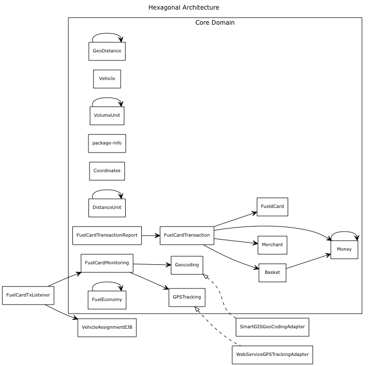

# Living Documentation Jumpstart Workshop
*Cyrille Martraire (@cyriux) 2015*

## Evergreen Documents
*Documents about stable knowledge need no maintenance*

[An example of a living diagram page](../livinggdiagram.html)

[Another example of a living diagram page](../systemdiagram.html)

[A link to the generated guided tour page](../Quick_Developer_Tour.html)

[A link to the generated word cloud page](../wordcloud.html)

## Shameful Comments (Simplify & Fix weird stuff)
*Comments where their very existence highlights issues in the code*

- Open the class *FuelCardMonitoring* in the package *flottio.fuelcardmonitoring.domain*
- Review its comments and find where you could improve the code in a way that would make some of the comments useless
- Refactor to remove shameful comments 
- Debrief

## How does your code tell the business domain?
*And you were supposed to practice DDD?*

- Extract a word cloud on the source folder "/src/main/java/flottio/dispatching" (run *WordCloudTest* in *flottio.livingdocumentation*)
- Discuss the result
- Run the word cloud again on the source folder "/src/main/java/flottio/fuelcardmonitoring" to compare

## Make a Living Glossary

- Run the Living Glossary
- Make changes to the code: rename, move class to infra, remove annotation, change comments...
- Discuss 

*One Bounded Context is obviously legacy and cannot provide a nice living glossary: to exclude*

## Does your code tell the design?

- Run the provided living Diagram
- Discuss the trouble with the diagram

We want this diagram to show the Hexagonal Architecture design decision
- Check the design against the Hexagonal Architecture pattern
- Rename, add or delete classes and re-run the diagram
